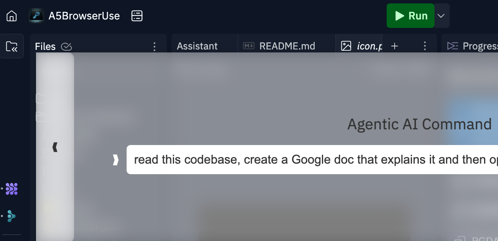
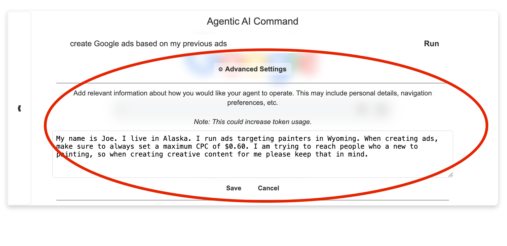

# A5-Browser-Use Chrome Extension and Server for Agentic AI Workflows

Your commands control the browser - made easy.



**A5** is an open-source project that integrates the powerful [**Browser Use** Python library](https://github.com/browser-use/browser-use) with a user-friendly RESTful API and Chrome extension. It aims to simplify agentic AI-powered browser automation tasks by providing an all-in-one solution that requires minimal setup, making it accessible to both developers and non-developers alike.

### Chrome Extension Demo:


---

## Important (Experimental) Notice

This project is **experimental**. You can run it easily on macOS by using the executable generated in the `Python_server/dist` folder (e.g., `./a5browseruse` on macOS). For other platforms like **Linux** and **Windows**, you can build or run the server similarly (see the [Installation](#installation) steps for more details).

### WARNING: Important before proceeding

Make sure to start Chrome in debug mode or you will get irratic behavior (many browser windows opening and closing). Instructions are below on how to do that based on your operating system. Additionally, you will need to create a .env file in the Python_server folder with your OpenAI or other provider credentials. Currently, only the OpenAI API is supported; however, support for other providers are in the works. Pull requests are welcomed!


### Quick Start (macOS)

Note: Mac Users *should* be able to run the executable (*after making sure to start Chrome in debug mode, per the warning above*) located in the `Python_server/dist` folder by navigating to the Python_server/dist folder and running  `./a5browseruse`. Additionally, you will need to create a .env file in the `Python_server/dist` folder with your OpenAI or other provider credentials. An example of the format is available in the .env.example file.

However, if this does not work or alternatively, you can follow these steps to set it up manually:

1. **Close all Chrome windows completely.**  
2. *IMPORTANT* : **Start Chrome with Remote Debugging Enabled** (required by Browser Use):
   ```bash
   /Applications/Google\ Chrome.app/Contents/MacOS/Google\ Chrome --remote-debugging-port=9222
   ```

3. Make sure you have **Python 3.11** or higher installed.

4. From the `Python_server` folder, install dependencies:
   ```bash
   pip install -r requirements.txt
   ```
5. Close Chrome, and start Chrome with remote debugging:
   ```bash
   /Applications/Google\ Chrome.app/Contents/MacOS/Google\ Chrome --remote-debugging-port=9222
   ```
6. In a separate terminal window, still in `Python_server`, start the server:
   ```bash
   uvicorn main:app --host 127.0.0.1 --port 8888 --reload --workers 1
   ```
7. Once the server is running, open [http://127.0.0.1:8888/](http://127.0.0.1:8888/) to verify it’s active.

### Quick Start (Linux and Windows)

1. **Close all Chrome windows completely.**  
2. **Start Chrome with Remote Debugging Enabled**:
   - **Windows** (in Command Prompt or PowerShell):
     ```cmd
     "C:\Program Files\Google\Chrome\Application\chrome.exe" --remote-debugging-port=9222
     ```
   - **Linux** (in Terminal):
     ```bash
     google-chrome --remote-debugging-port=9222
     ```
3. **Run the Python Server** (similarly as macOS):
   ```bash
   cd Python_server
   pip install -r requirements.txt
   uvicorn main:app --host 127.0.0.1 --port 8888 --reload --workers 1
   ```
4. **Access the API** at [http://127.0.0.1:8888/](http://127.0.0.1:8888/).

> If you need a standalone executable on Windows or Linux, you’ll have to build it **on** that platform (since PyInstaller doesn’t support cross-compiling). The resulting file will be in the `dist` folder for that OS.

---

## Table of Contents

- [Features](#features)
- [Prerequisites](#prerequisites)
- [Installation](#installation)
  - [Clone the Repository](#clone-the-repository)
  - [Set Up the Python Server](#set-up-the-python-server)
  - [Install the Chrome Extension](#install-the-chrome-extension)
- [Usage](#usage)
- [Contributing](#contributing)
- [License](#license)

---

## Features

- **Seamless Integration**: Combines a Chrome extension with a Python backend to execute browser commands effortlessly  
- **AI-Powered Automation**: Utilizes OpenAI's language models (and future expansions!) to interpret and perform complex browser tasks  
- **Cross-Platform Support**: Compatible with Windows, macOS, and Linux  
- **Open-Source**: Community-driven development to continuously enhance functionality and usability  
- **RESTful API**: Well-documented API endpoints for easy integration and extensibility


*NEW* 

- **Context Storage**: You can add context to be saved and used for all of your commands (across sessions). Click "Advanced Settings" under the command bar, and save information that will be included with each initial command. This can include methods for overcoming obstacles you have observed or to prevent having to repeat the same information everytime. You can edit this at any time or clear the information.




---

## Prerequisites

Before you begin, ensure you have met the following requirements:

- **Python 3.11 or higher** installed on your machine ([Download Python](https://www.python.org/downloads/))  
- **Google Chrome** browser installed ([Download Chrome](https://www.google.com/chrome/))  
- **Git** installed for cloning the repository ([Download Git](https://git-scm.com/downloads))

---

## Installation

Follow these steps to set up **A5-Browser-Use** on your local machine.

### Clone the Repository

```bash
git clone https://github.com/AgenticA5/A5-Browser-Use.git
cd A5-Browser-Use
```

### Set Up the Python Server

1. Navigate to the `Python_server` folder:
   ```bash
   cd Python_server
   ```
2. Install the dependencies:
   ```bash
   pip install -r requirements.txt
   ```
3. Close *all instances* of Chrome, then start it with remote debugging:
   - **macOS**:
     ```bash
     /Applications/Google\ Chrome.app/Contents/MacOS/Google\ Chrome --remote-debugging-port=9222
     ```
   - **Windows**:
     ```cmd
     "C:\Program Files\Google\Chrome\Application\chrome.exe" --remote-debugging-port=9222
     ```
   - **Linux**:
     ```bash
     google-chrome --remote-debugging-port=9222
     ```
4. You will need to create a .env file in the `Python_server/` folder with your OpenAI or other provider credentials. An example of the format is available in the .env.example file.

5. In a new terminal window (while Chrome is running in remote debugging mode), start the FastAPI server:
   ```bash
   uvicorn main:app --host 127.0.0.1 --port 8888 --reload --workers=1
   ```
6. Go to [http://localhost:8888/lastResponses](http://localhost:8888/lastResponses/) in your browser to confirm the server is running.

### Install the Chrome Extension

1. Open Google Chrome and go to **Settings** → **Extensions**.
2. Enable **Developer Mode** in the top right corner.
3. Click **Load unpacked** or **Load Unpacked Extension**.
4. Select the `Chrome_extension` folder from this repository.

> Once installed, the extension adds a small arrow on the left side of your browser window. Click it to expand and issue commands to the Python server (powered by the AI backend).

---

## Usage

After the setup:

1. **Open Chrome** (in remote debugging mode).  
2. **Start your Python server** via `uvicorn` or the executable from `Python_server/dist` (if you built one for your OS).  
3. **Click the Arrow** in Chrome (added by the extension) to expand the control panel.  
4. **Issue Commands**: Type your instruction, and the agent will attempt to perform the requested browser actions.

---

## Contributing

We welcome contributions from the community! In particular, if you’d like to add support for additional AI providers beyond OpenAI, **please open a Pull Request**.

1. **Fork the Project**
2. **Create a new branch** (`git checkout -b feature/YourFeature`)
3. **Commit your changes** (`git commit -m 'Add some feature'`)
4. **Push to your branch** (`git push origin feature/YourFeature`)
5. **Open a Pull Request**

---

## License

This project is licensed under the [MIT License](LICENSE). Feel free to modify and distribute it as per the license terms.

---

### Final Notes

- **Close Chrome Completely** before you re-run the server in remote debugging mode. Otherwise, the agent can’t connect properly.  
- For **Windows** and **Linux** executables, you must build them on their respective OS. PyInstaller won’t cross-compile from macOS.  
- The extension simply adds an arrow on the left of your browser that, when clicked, opens a sidebar to issue AI commands.  
- **Future Plans**: We plan to expand beyond OpenAI for multiple LLM backends—stay tuned, or submit a PR!

If you have any questions or run into issues, feel free to open an issue in the repo or reach out to the maintainers. Enjoy **A5-Browser-Use**!